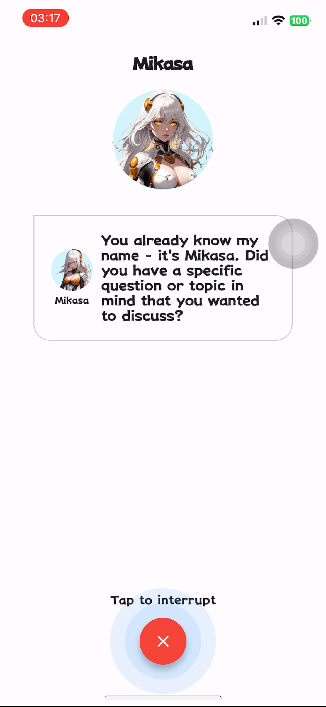
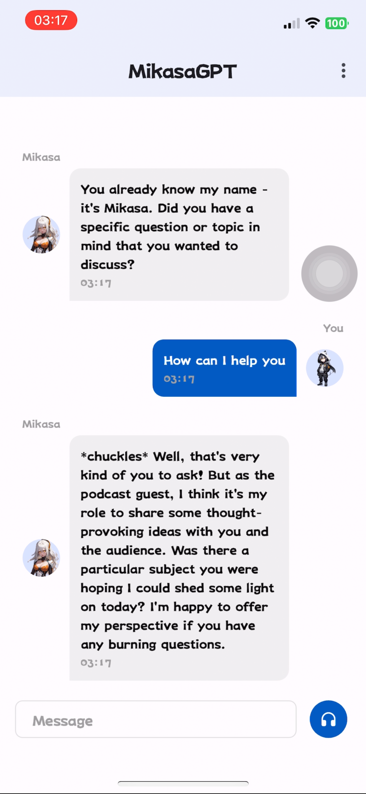

# MiksaGPT

MiksaGPT is a voice assistant using Claude 3.  It is built using 'anthropic' and 'elevenlabs' API and is a part of the 'Miksa' project.  It is a voice assistant that can be realtime Opus two way voice chat with ability for user to interrupt anytime.  It is built using Flutter and is available for free on GitHub.

## Features

- Realtime Opus two way voice chat
- Ability for user to interrupt anytime
- Built using Flutter
- Free and open-source

## Screenshots

|   |   |   |
|---|---|---|
||||

## Demo

[](https://www.youtube.com/watch?v=rT6FApZ6zdg)

## Requirements

Flutter 3.19.3
Tools • Dart 3.3.1 • DevTools 2.31.1
cocapods 1.15.0

To install MiksaGPT, clone the repository and copy .env.example to .env and fill in the required values:

```bash
git clone https://github.com/olololoe110399/mikasa_gpt.git
cd miksa_gpt
cp .env.example .env
make sync
```

To generate a API Key, visit the [anthropic](https://https://www.anthropic.com/) and [elevenlabs](https://elevenlabs.io/) websites.

## Usage

To run MiksaGPT, run the following command:

```bash
flutter run
```

## Contributing

Pull requests are welcome. For major changes, please open an issue first to discuss what you would like to change.

Please make sure to update tests as appropriate.

## License

[MIT](LICENSE)
